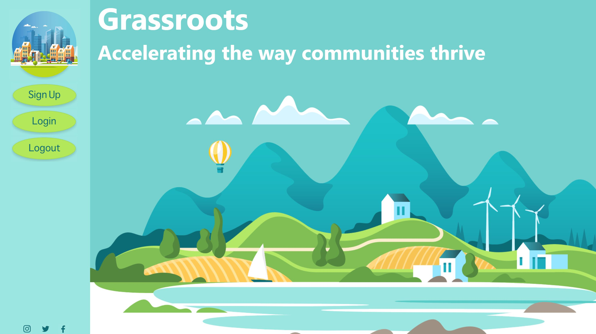
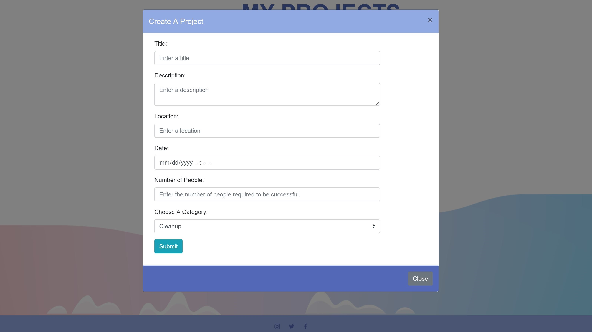
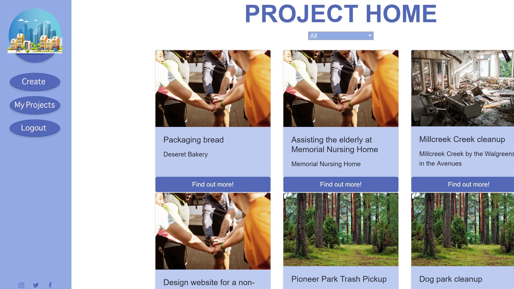

# Grassroots

### deployed at:
https://whispering-lowlands-40011.herokuapp.com/

## Description
Grassroots is a community optimizing application that allows users to create, join, and share community project templates. By accessing our database, users have access to all community projects created so that they can organize their ideas and become inspired by what others are doing.

## Development Team
- Jaron Johnson
- Brandon Lerner
- Dan Mont-Eton
- Rebecca Potter

## Motivation
This project solves the issue of communities burning out in their constant ways of outreach. Communities can see what is working across the US and better serve their local community.

## Results
Our end result is a very standard template organizer and database that streamlines the creation of community service projects. We have authentication to keep user’s projects and information secure and safe. 

## Using the App
Users may register and create community projects through form submission. From there other users may search for projects that they can copy and bring to their communities or their home page.

### Technologies Used
- HTML/CSS
- Node
- Express
- Express-sessions
- Javascript
- SQL
- Bcrypt.js
- Passport
- Heroku hosting
- Bootstrap

## Photos

#### Home Page

#### Top Projects Page

#### Create

#### User Home Page
